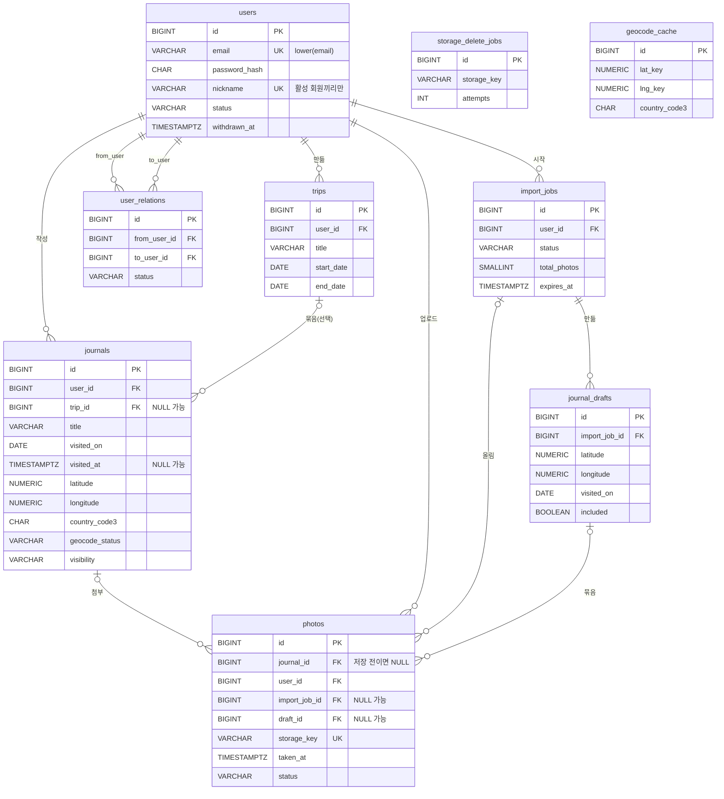

# 지구본 여행일지 DB 설계서

Oct 1, 2026 · @깡통

## 설계 기준

요구사항 명세서 버전 1.3을 기준으로 한 MVP 범위의 DB 설계다. 테이블은 9개다. 버전 1.1에서 DBMS를 MySQL에서 PostgreSQL로 바꿨고, 버전 1.2에서 사진으로 기록하기(FR-25)와 여행 타임랩스(FR-26)를 위한 테이블 3개와 컬럼을 추가했다.

- **DBMS**: PostgreSQL 16 (UTF-8). 확장은 pg\_trgm(닉네임 부분 검색)만 쓴다. 반경 검색 같은 공간 기능이 필요해지면 PostGIS를 추가한다.
- **이름**: 테이블은 복수형 snake\_case, PK는 `id`, FK는 `<대상 단수>_id`.
- **PK**: `BIGINT GENERATED ALWAYS AS IDENTITY`.
- **시간**: 생성·수정 시각은 `TIMESTAMPTZ`(UTC로 저장). 방문 날짜와 여행 기간은 현지 날짜 그대로 `DATE`.
- **상태값**: PostgreSQL ENUM 타입 대신 `VARCHAR` + CHECK 제약으로 허용 값을 막고, JPA에서 `@Enumerated(EnumType.STRING)`으로 매핑한다.
- **삭제**: 회원만 소프트 삭제(FR-19). 일지, 여행, 사진, 친구 관계는 즉시 하드 삭제(NFR-09).
- **외래 키**: 기본은 RESTRICT. 일지에서 여행으로 가는 FK만 `ON DELETE SET NULL (trip_id)`로 여행 삭제 시 일지를 남긴다(FR-09). 사진 파일 정리가 필요한 삭제는 DB CASCADE에 맡기지 않고 애플리케이션이 순서대로 처리한다(NFR-07).
- **FK 인덱스**: PostgreSQL은 MySQL과 달리 FK 컬럼에 인덱스를 자동으로 만들지 않는다. 필요한 인덱스는 모두 '인덱스' 절에 적었다.

## ERD

회원이 중심이고, 일지는 여행에 선택적으로 묶인다. 친구·차단 관계는 두 회원 사이에 한 행으로 저장한다. 사진으로 기록하기는 가져오기 작업(import\_jobs) 아래에 초안과 사진을 모았다가, 저장하면 일지로 옮긴다. 파일 삭제 재시도 목록과 역지오코딩 캐시는 다른 테이블과 FK로 연결하지 않는다.



주요 컬럼만 그렸다. 전체 컬럼은 아래 테이블 정의를 따른다.

## 테이블 정의

모든 테이블에 `created_at`이 있고, 수정되는 테이블에는 `updated_at`도 있다(둘 다 `TIMESTAMPTZ NOT NULL`). 아래 표에서는 생략한다. UNIQUE 중 식이나 조건이 붙는 것은 '인덱스' 절에 있다.

### users (회원)

| 컬럼 | 타입 | 제약 | 설명 |
| --- | --- | --- | --- |
| id | BIGINT | PK (IDENTITY) |  |
| email | VARCHAR(255) | NOT NULL | 로그인 아이디. lower(email) 기준으로 중복 불가. 탈퇴 유예 중에도 남겨 같은 이메일 재가입을 막는다 |
| password\_hash | CHAR(60) | NOT NULL | BCrypt 해시 |
| nickname | VARCHAR(12) | NOT NULL | 활성 회원끼리만 lower(nickname) 기준으로 중복 불가. 탈퇴해도 값은 남지만, 다른 회원이 같은 닉네임을 쓸 수 있다 |
| status | VARCHAR(20) | NOT NULL, CHECK | ACTIVE, WITHDRAWN |
| withdrawn\_at | TIMESTAMPTZ | NULL | 탈퇴 시각. 30일이 지난 행은 배치가 영구 삭제 |

### journals (일지)

| 컬럼 | 타입 | 제약 | 설명 |
| --- | --- | --- | --- |
| id | BIGINT | PK (IDENTITY) |  |
| user\_id | BIGINT | NOT NULL, FK → users.id | 작성자 |
| trip\_id | BIGINT | NULL, FK (trip\_id, user\_id) → trips (id, user\_id), ON DELETE SET NULL (trip\_id) | 묶인 여행. 복합 FK라서 내 여행에만 묶을 수 있다 |
| title | VARCHAR(50) | NOT NULL |  |
| visited\_on | DATE | NOT NULL | 미래 날짜 불가(애플리케이션에서 검증) |
| visited\_at | TIMESTAMPTZ | NULL | 방문 시각. 사진으로 기록한 일지는 첫 사진의 촬영 시각, 직접 기록은 NULL. 타임랩스에서 같은 날짜의 순서를 정한다 (FR-26) |
| memo | VARCHAR(2000) | NULL |  |
| latitude | NUMERIC(8,6) | NOT NULL, CHECK (-90\~90) |  |
| longitude | NUMERIC(9,6) | NOT NULL, CHECK (-180\~180) |  |
| country\_code2 | CHAR(2) | NULL | ISO alpha-2. 지오코딩 대기 중에만 NULL |
| country\_code3 | CHAR(3) | NULL | ISO alpha-3. 방문 국가 색칠 기준 |
| admin\_area1 | VARCHAR(100) | NULL | 시·도 |
| admin\_area2 | VARCHAR(100) | NULL | 시·군·구 |
| place\_name | VARCHAR(100) | NULL | 표시용 장소명 |
| geocode\_status | VARCHAR(20) | NOT NULL, CHECK | DONE, PENDING |
| visibility | VARCHAR(20) | NOT NULL, CHECK, 기본값 PRIVATE | PRIVATE, FRIENDS, PUBLIC |

### trips (여행)

| 컬럼 | 타입 | 제약 | 설명 |
| --- | --- | --- | --- |
| id | BIGINT | PK (IDENTITY) |  |
| user\_id | BIGINT | NOT NULL, FK → users.id | 만든 사람 |
| title | VARCHAR(50) | NOT NULL |  |
| start\_date | DATE | NOT NULL |  |
| end\_date | DATE | NULL, CHECK (end\_date IS NULL OR end\_date >= start\_date) |  |
| description | VARCHAR(500) | NULL |  |

(id, user\_id)에 UNIQUE를 걸어 journals의 복합 FK가 참조할 수 있게 한다.

### photos (사진)

| 컬럼 | 타입 | 제약 | 설명 |
| --- | --- | --- | --- |
| id | BIGINT | PK (IDENTITY) |  |
| journal\_id | BIGINT | NULL, FK → journals.id | 일지 저장 전(임시 업로드, 초안)에는 NULL |
| user\_id | BIGINT | NOT NULL, FK → users.id | 올린 사람. 임시 파일을 남의 일지에 붙이지 못하게 확인할 때 쓴다 |
| import\_job\_id | BIGINT | NULL, FK → import\_jobs.id | 사진으로 기록 중인 사진. 저장이 끝나면 NULL |
| draft\_id | BIGINT | NULL, FK → journal\_drafts.id | 묶인 초안. 위치를 정해야 하는 사진은 NULL |
| storage\_key | VARCHAR(255) | NOT NULL, UNIQUE | 저장소의 원본 경로 |
| thumbnail\_key | VARCHAR(255) | NULL | 400px 썸네일 경로 |
| taken\_at | TIMESTAMPTZ | NULL | EXIF 촬영 시각 |
| gps\_latitude | NUMERIC(8,6) | NULL | EXIF 촬영 위도. 묶기가 끝나면 지운다 |
| gps\_longitude | NUMERIC(9,6) | NULL | EXIF 촬영 경도. 묶기가 끝나면 지운다 |
| status | VARCHAR(20) | NOT NULL, CHECK | TEMP, ACTIVE |
| sort\_order | SMALLINT | NOT NULL, CHECK (0\~4), 기본값 0 | 일지 안 순서. 장수 제한 5장은 애플리케이션에서도 검사 |
| content\_type | VARCHAR(50) | NOT NULL | image/jpeg 등 |
| size\_bytes | INTEGER | NOT NULL | 줄인 뒤의 파일 크기 |

사진으로 기록하는 동안 "위치를 정해야 하는 사진"은 import\_job\_id는 있고 draft\_id는 없는 사진이다.

### user\_relations (친구·차단)

두 회원 사이의 관계는 상태와 상관없이 한 행만 둔다. 거절, 요청 취소, 친구 삭제, 차단 해제는 행을 지운다.

| 컬럼 | 타입 | 제약 | 설명 |
| --- | --- | --- | --- |
| id | BIGINT | PK (IDENTITY) |  |
| from\_user\_id | BIGINT | NOT NULL, FK → users.id | PENDING이면 요청한 사람, BLOCKED면 차단한 사람 |
| to\_user\_id | BIGINT | NOT NULL, FK → users.id | PENDING이면 요청받은 사람, BLOCKED면 차단당한 사람 |
| status | VARCHAR(20) | NOT NULL, CHECK | PENDING, ACCEPTED, BLOCKED |

- UNIQUE 인덱스 (LEAST(from\_user\_id, to\_user\_id), GREATEST(from\_user\_id, to\_user\_id)): 별도 컬럼 없이 식으로 인덱스를 만든다. A가 B에게, B가 A에게 동시에 요청해도 행이 둘 생기지 않는다. 두 번째 요청은 FR-11 규칙대로 수락으로 처리한다.
- CHECK (from\_user\_id <> to\_user\_id): 자기 자신과의 관계는 만들 수 없다.
- 차단하면 기존 행의 status를 BLOCKED로 바꾸고 from/to를 차단 방향으로 맞춘다.

### storage\_delete\_jobs (파일 삭제 재시도 목록)

NFR-07의 재시도 목록이다. 삭제가 실패한 파일만 쌓이고, 하루 한 번 배치가 다시 지운다.

| 컬럼 | 타입 | 제약 | 설명 |
| --- | --- | --- | --- |
| id | BIGINT | PK (IDENTITY) |  |
| storage\_key | VARCHAR(255) | NOT NULL | 지울 파일 경로. 원본과 썸네일은 각각 한 행 |
| attempts | INTEGER | NOT NULL, 기본값 0 | 시도 횟수 |
| last\_error | VARCHAR(255) | NULL | 마지막 실패 사유 |

### import\_jobs (사진 가져오기 작업)

사진으로 기록하기(FR-25) 한 번이 한 행이다. 사용자가 저장을 마치면 행을 지우고, 저장하지 않은 작업은 24시간 뒤 사진과 함께 정리한다(NFR-08).

| 컬럼 | 타입 | 제약 | 설명 |
| --- | --- | --- | --- |
| id | BIGINT | PK (IDENTITY) |  |
| user\_id | BIGINT | NOT NULL, FK → users.id | 올린 사람 |
| status | VARCHAR(20) | NOT NULL, CHECK | UPLOADING(올리는 중), GROUPING(위치·시각 읽기와 묶기), READY(초안 확인 가능), FAILED |
| total\_photos | SMALLINT | NOT NULL, CHECK (1\~100) | 고른 사진 수 |
| uploaded\_photos | SMALLINT | NOT NULL, 기본값 0 | 올라간 사진 수. 진행률 표시에 쓴다 |
| expires\_at | TIMESTAMPTZ | NOT NULL | 만든 시각 + 24시간 |

### journal\_drafts (일지 초안)

묶기 결과 하나가 한 행이다. 저장하면 included가 참인 초안만 journals로 옮기고, 작업 행이 지워질 때 함께 지워진다(ON DELETE CASCADE). 초안에는 파일이 직접 붙어 있지 않아서 CASCADE를 써도 된다.

| 컬럼 | 타입 | 제약 | 설명 |
| --- | --- | --- | --- |
| id | BIGINT | PK (IDENTITY) |  |
| import\_job\_id | BIGINT | NOT NULL, FK → import\_jobs.id (ON DELETE CASCADE) |  |
| title | VARCHAR(50) | NOT NULL | 역지오코딩한 장소명으로 채우고, 사용자가 고칠 수 있다 |
| visited\_on | DATE | NOT NULL | 첫 사진의 날짜 |
| visited\_at | TIMESTAMPTZ | NULL | 첫 사진의 촬영 시각 |
| memo | VARCHAR(2000) | NULL |  |
| latitude | NUMERIC(8,6) | NOT NULL | 묶인 사진 좌표의 중심, 또는 사용자가 정한 위치 |
| longitude | NUMERIC(9,6) | NOT NULL |  |
| country\_code2 \~ place\_name |  |  | journals와 같은 5개 컬럼 |
| geocode\_status | VARCHAR(20) | NOT NULL, CHECK | DONE, PENDING |
| included | BOOLEAN | NOT NULL, 기본값 TRUE | 저장에 포함할지(화면의 체크 표시) |

### geocode\_cache (역지오코딩 캐시)

NFR-11에 따라 같은 위치의 역지오코딩 결과를 재사용한다. 좌표를 소수점 3자리(약 110m)로 반올림한 값이 키다.

| 컬럼 | 타입 | 제약 | 설명 |
| --- | --- | --- | --- |
| id | BIGINT | PK (IDENTITY) |  |
| lat\_key | NUMERIC(6,3) | NOT NULL | 반올림한 위도 |
| lng\_key | NUMERIC(7,3) | NOT NULL | 반올림한 경도 |
| country\_code2 | CHAR(2) | NULL | 바다면 NULL |
| country\_code3 | CHAR(3) | NULL | 바다면 NULL |
| admin\_area1 | VARCHAR(100) | NULL |  |
| admin\_area2 | VARCHAR(100) | NULL |  |
| place\_name | VARCHAR(100) | NULL |  |

만든 지 30일이 지난 행은 다시 조회해 갱신한다.

## 인덱스

PostgreSQL은 FK 컬럼에 인덱스를 자동으로 만들지 않으므로, PK를 뺀 모든 인덱스를 여기 적는다. 조건부 인덱스(WHERE)는 배치가 찾는 행만 담아서 작게 유지된다.

| 테이블 | 인덱스 | 쓰는 곳 |
| --- | --- | --- |
| users | UNIQUE (lower(email)) | 로그인, 이메일 중복 확인 (FR-01) |
| users | UNIQUE (lower(nickname)) WHERE status = 'ACTIVE' | 활성 회원끼리 닉네임 중복 확인 (FR-18, 19) |
| users | GIN (nickname gin\_trgm\_ops) | 닉네임 부분 검색, ILIKE '%검색어%' (FR-17) |
| users | (withdrawn\_at) WHERE status = 'WITHDRAWN' | 30일 지난 탈퇴 회원 정리 배치 (NFR-09) |
| journals | (user\_id, visibility) | 지구본 핀과 방문 국가, 공개 범위 필터 (FR-04, 05, NFR-03) |
| journals | (user\_id, visited\_on) | 연도별 타임랩스 (FR-26) |
| journals | (trip\_id, visited\_on) | 여행 상세의 날짜순 일지, 여행 타임랩스 (FR-09, 26) |
| journals | (id) WHERE geocode\_status = 'PENDING' | 지오코딩 재시도 배치 (FR-06) |
| trips | UNIQUE (id, user\_id) | journals 복합 FK의 참조 대상 (FR-09) |
| trips | (user\_id, start\_date) | 여행 목록 (FR-09) |
| photos | (journal\_id, sort\_order) | 일지의 사진 순서 (FR-07) |
| photos | (user\_id) | 회원 영구 삭제 때 FK 확인 (NFR-09) |
| photos | (import\_job\_id) WHERE import\_job\_id IS NOT NULL | 작업별 사진, 위치를 정해야 하는 사진 (FR-25) |
| photos | (draft\_id) WHERE draft\_id IS NOT NULL | 초안별 사진 (FR-25) |
| photos | (created\_at) WHERE status = 'TEMP' | 24시간 지난 임시 파일 정리 (NFR-08) |
| import\_jobs | (user\_id) | 진행 중인 작업 이어 보기 (FR-25) |
| import\_jobs | (expires\_at) | 만료된 작업 정리 (NFR-08) |
| journal\_drafts | (import\_job\_id) | 작업의 초안 목록 (FR-25) |
| geocode\_cache | UNIQUE (lat\_key, lng\_key) | 역지오코딩 결과 재사용 (NFR-11) |
| user\_relations | UNIQUE (LEAST(from\_user\_id, to\_user\_id), GREATEST(from\_user\_id, to\_user\_id)) | 두 회원의 관계 조회, 중복 방지 (FR-11, NFR-03) |
| user\_relations | (to\_user\_id, status) | 받은 요청 목록 (FR-20) |
| user\_relations | (from\_user\_id, status) | 보낸 요청 목록, 차단 목록 (FR-20, 21) |

## 핵심 쿼리

요구사항 명세서의 공개 범위 판정 순서를 DB에서 어떻게 확인하는지 보여 준다. `:viewer`는 보는 사람, `:owner`는 지구본 주인이다.

**1. 두 회원의 관계 확인** (판정 순서 3, 5단계)

```sql
SELECT status, from_user_id
FROM user_relations
WHERE LEAST(from_user_id, to_user_id)    = LEAST(:viewer, :owner)
  AND GREATEST(from_user_id, to_user_id) = GREATEST(:viewer, :owner);
```

WHERE 절의 식이 인덱스의 식과 똑같아야 UNIQUE 인덱스를 탄다. 결과가 BLOCKED면 "찾을 수 없음"으로 응답하고, ACCEPTED면 친구로 판정한다. 행이 없거나 PENDING이면 그 외 회원이다. 주인이 탈퇴했는지(users.status)는 이보다 먼저 확인한다.

**2. 보는 사람에게 보이는 일지** (지구본 핀, FR-04)

```sql
SELECT id, latitude, longitude, title, visited_on
FROM journals
WHERE user_id = :owner
  AND visibility IN (:allowed);
-- 본인: PRIVATE, FRIENDS, PUBLIC / 친구: FRIENDS, PUBLIC / 그 외: PUBLIC
```

**3. 방문한 나라** (색칠, FR-05)

```sql
SELECT DISTINCT country_code3
FROM journals
WHERE user_id = :owner
  AND visibility IN (:allowed)
  AND country_code3 IS NOT NULL;
```

2, 3번의 `:allowed` 목록은 1번 결과로 서버가 정한다. 클라이언트가 보낸 값은 쓰지 않는다(NFR-03).

**4. 닉네임 검색** (FR-17)

```sql
SELECT u.id, u.nickname
FROM users u
WHERE u.status = 'ACTIVE'
  AND u.nickname ILIKE '%' || :keyword || '%'
  AND NOT EXISTS (
    SELECT 1 FROM user_relations r
    WHERE r.status = 'BLOCKED'
      AND LEAST(r.from_user_id, r.to_user_id)    = LEAST(u.id, :viewer)
      AND GREATEST(r.from_user_id, r.to_user_id) = GREATEST(u.id, :viewer)
  )
ORDER BY u.nickname
LIMIT 20 OFFSET :offset;
```

`ILIKE`는 대소문자를 무시하는 LIKE이고, pg\_trgm GIN 인덱스가 앞에 %가 붙은 검색도 받쳐 준다. 어느 쪽이든 차단 관계인 회원은 NOT EXISTS로 뺀다.

**5. 여행 타임랩스 순서** (FR-26)

```sql
SELECT id, latitude, longitude, title, visited_on
FROM journals
WHERE trip_id = :tripId
  AND visibility IN (:allowed)
ORDER BY visited_on, visited_at NULLS LAST, created_at;
```

같은 날짜면 촬영 시각 순으로, 촬영 시각이 없는 직접 기록 일지는 그 뒤에 작성 순으로 놓는다. 연도 타임랩스는 `trip_id` 조건 대신 `user_id = :owner AND visited_on`의 연도 범위로 조회한다.

## 요구사항 추적

DB에 저장해야 하는 MVP 요구사항이 모두 어느 테이블·컬럼에 담기는지 확인한 표다. FR-03(지구본 회전), FR-22(클러스터링), FR-23(빈 상태 화면)은 화면에서 처리해 DB 변경이 없다.

| 요구사항 | 테이블 · 컬럼 |
| --- | --- |
| FR-01 가입·로그인 | users.email, password\_hash |
| FR-02, 18 닉네임 | users.nickname |
| FR-19 회원 탈퇴 | users.status, withdrawn\_at |
| FR-04, 05, 06 핀·색칠·위치 | journals 좌표와 국가·행정구역 컬럼, geocode\_status |
| FR-07, 08 일지 작성·조회·수정·삭제 | journals, photos |
| FR-09 여행 | trips, journals.trip\_id |
| FR-10 공개 범위 | journals.visibility |
| FR-11, 20, 21 친구·요청·차단 | user\_relations |
| FR-12, 16 남의 지구본 보기 | journals.visibility, user\_relations |
| FR-13, 26 여행 경로와 타임랩스 | journals.visited\_on, visited\_at, trip\_id |
| FR-17 닉네임 검색 | users.nickname, status |
| FR-25 사진으로 기록하기 | import\_jobs, journal\_drafts, photos.import\_job\_id, draft\_id, taken\_at, gps\_latitude, gps\_longitude |
| NFR-07 파일 삭제 재시도 | storage\_delete\_jobs |
| NFR-08 임시 업로드와 초안 정리 | photos.status, created\_at, import\_jobs.expires\_at |
| NFR-09 탈퇴 회원 영구 삭제 | users.withdrawn\_at |
| NFR-11 비동기 처리와 역지오코딩 재사용 | import\_jobs.status, uploaded\_photos, geocode\_cache |

## 설계 결정

| 항목 | 결정 | 근거 |
| --- | --- | --- |
| 일지 초안 저장 (1.2) | journals와 분리한 journal\_drafts 테이블 | journals에 상태 컬럼으로 섞으면 모든 조회 쿼리에 "초안 제외" 조건을 붙여야 하고, 하나만 빠져도 초안이 지구본에 노출된다 |
| 촬영 좌표 보관 (1.2) | 묶기가 끝나면 photos의 GPS 컬럼을 지움 | 파일의 EXIF를 지워도 DB에 원본 좌표가 남으면 위험은 그대로다. 일지에는 중심 좌표만 남는다 |
| 가져오기 작업 수명 (1.2) | 저장이 끝나면 행 삭제, 방치·실패한 작업은 24시간 뒤 정리 | 작업 이력을 남길 요구가 없고, 개인정보를 오래 들고 있지 않는다 |
| 진행률 전달 (1.2) | 화면이 2초마다 작업 상태를 조회(폴링) | 구현이 가장 단순하다. 필요해지면 SSE(서버가 보내는 이벤트)로 바꾼다 |
| 비동기 실행 (1.2) | Spring @Async와 DB의 작업 상태 값으로 시작 | 사용자 규모가 작아 메시지 큐 없이 충분하다. 서버가 재시작되어 끊긴 작업은 상태 값으로 찾아 다시 처리한다 |
| 역지오코딩 캐시 (1.2) | 좌표를 약 110m 단위로 반올림해 결과 재사용, 30일마다 갱신 | 같은 장소에서 찍은 사진 수십 장에 API를 수십 번 부르지 않는다(NFR-11). 지오코딩 제공자의 약관이 결과 저장을 허용하는지 확인해야 한다 |
| DBMS (1.1) | PostgreSQL 16 (MySQL 8.0 대신 채택) | 조건부 인덱스, 식 인덱스, 비울 열을 지정하는 SET NULL, pg\_trgm 덕분에 MySQL 설계의 우회책 네 가지가 사라진다. 공간 기능이 필요해지면 PostGIS를 붙일 수 있다 |
| 친구·차단 저장 | 한 테이블, 두 회원 사이 한 행 | 명세의 상태값 3개를 그대로 담고, LEAST/GREATEST 식 UNIQUE 인덱스로 양방향 중복 요청을 DB가 막는다. 차단당한 쪽은 상대를 찾을 수 없어서 서로 차단하는 경우가 생기지 않는다 |
| 탈퇴 회원 닉네임 | 값은 남기고, 활성 회원끼리만 UNIQUE | 조건부 유니크 인덱스로 그대로 표현된다. 이후 계정 복구(FR-24) 때 닉네임이 이미 쓰이고 있으면 새 닉네임을 정하게 한다 |
| 여행 소유권 | DB에서 강제: 복합 FK + ON DELETE SET NULL (trip\_id) | PostgreSQL 15부터 SET NULL에 비울 열을 지정할 수 있어서, 여행이 지워져도 일지의 user\_id는 남는다 |
| 사진 삭제 | CASCADE 대신 애플리케이션이 처리 | 파일 경로를 먼저 읽어 둬야 커밋 후 저장소에서 지울 수 있다 (NFR-07) |
| 좌표 타입 | NUMERIC | 부동소수점 오차 없이 소수점 6자리를 그대로 보관한다 |
| 상태값 | VARCHAR + CHECK + EnumType.STRING | PostgreSQL ENUM 타입은 값 삭제나 이름 변경이 까다롭고, ORDINAL 매핑은 enum 순서가 바뀌면 기존 데이터의 의미가 바뀐다 |
| 닉네임 검색 | ILIKE + pg\_trgm GIN 인덱스 | 앞에 %가 붙는 부분 검색도 인덱스를 탄다 |
| FK 인덱스 | 직접 만든다 | PostgreSQL은 FK 인덱스를 자동으로 만들지 않는다. 빠뜨리면 부모 행을 지울 때마다 자식 테이블 전체를 훑는다 |
| 통계용 컬럼 | 두지 않음 | 방문 국가는 일지에서 그때그때 계산한다. 이후 FR-14(방문 통계)에서 필요하면 추가한다 |
